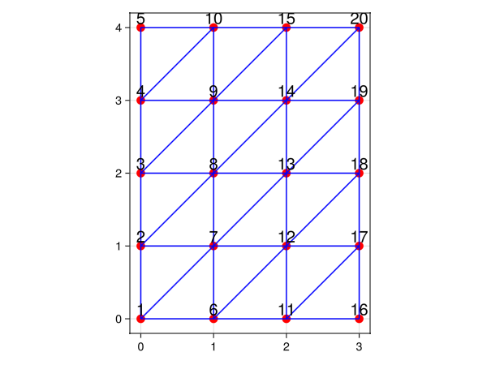

# SimpleLattices

[](https://nicolasloizeau.github.io/SimpleLattices.jl/stable/)
[](https://nicolasloizeau.github.io/SimpleLattices.jl/dev/)
[](https://github.com/nicolasloizeau/SimpleLattices.jl/actions/workflows/CI.yml?query=branch%3Amain)


This is a package for constructing lattices in Julia.

## Installation

```julia
using Pkg
Pkg.add(url="https://github.com/nicolasloizeau/SimpleLattices.jl")
```

## Usage

Standard lattices constructors are provided : `SquareLattice`, `CubicLattice`  `TriangularLattice`,`HexagonalLattice` and `KagomeLattice`. Custom lattices can be constructed using `UnitCell`.


Example: Construct a hexagonal lattice with 3*4 cells and periodic boundary conditions along the x-axis, and plot it:

```julia
using CairoMakie # for plotting
using SimpleLattices

lattice = HexagonalLattice(4,5; periodic=(true, false))

println(positions(lattice))
println(edges(lattice))

fig = plot_lattice(lattice)
display(fig)
```
```julia
[(0.0, 0.0), (0.5, 0.28867513459481287), (0.5, 0.8660254037844386),..., (5.0, 3.4641016151377544), (5.5, 3.7527767497325675)]
[[1, 2], [1, 32], [3, 4],..., [38, 39]]
```



